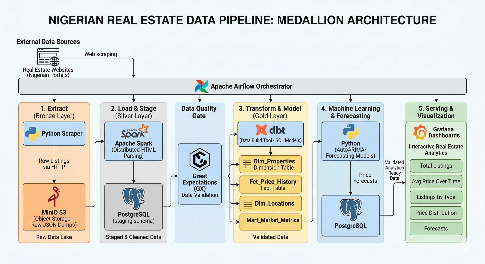

# 🏡 Real Estate Data Pipeline

This project presents an end-to-end data engineering pipeline for real estate analytics, designed to collect, process, validate, and forecast property market trends. The system leverages Python-based web scraping to extract listing data, which is ingested into a data lake and processed using Apache Spark. Data quality is enforced through Great Expectations, while transformations are managed using dbt to produce clean, analytics-ready datasets stored in PostgreSQL.

A time-series forecasting module built with Prophet generates insights into price and demand trends, with Redis providing a caching layer for efficient data access. The pipeline is orchestrated using Apache Airflow, and results are visualized through Grafana dashboards for real-time business intelligence.

This architecture demonstrates scalable, modular design principles and integrates modern data engineering tools to support reliable, reproducible, and insight-driven decision-making in the real estate domain.

## 🚀 Features

- Web scraping using BeautifulSoup
- Data lake storage (MinIO / S3)
- Distributed processing with Spark
- Time-series forecasting using Prophet
- Workflow orchestration with Airflow
- PostgreSQL serving layer for BI tools

---

## 🏗️ Architecture



---

## ⚙️ Tech Stack

- Python (Scraping, Forecasting)
- Apache Spark (ETL)
- PostgreSQL (Analytics DB)
- MinIO (S3-compatible storage)
- Airflow (Orchestration)
- Prophet (Forecasting)

---

## 🐳 Quick Start

### 1. Clone repo

```bash
git clone https://github.com/yourusername/real-estate-data-pipeline.git
cd real-estate-data-pipeline